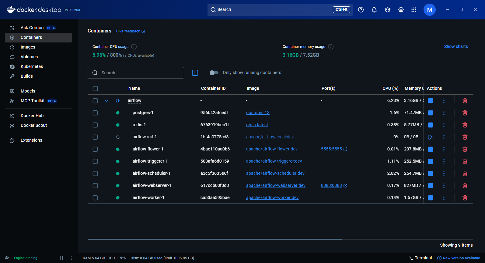
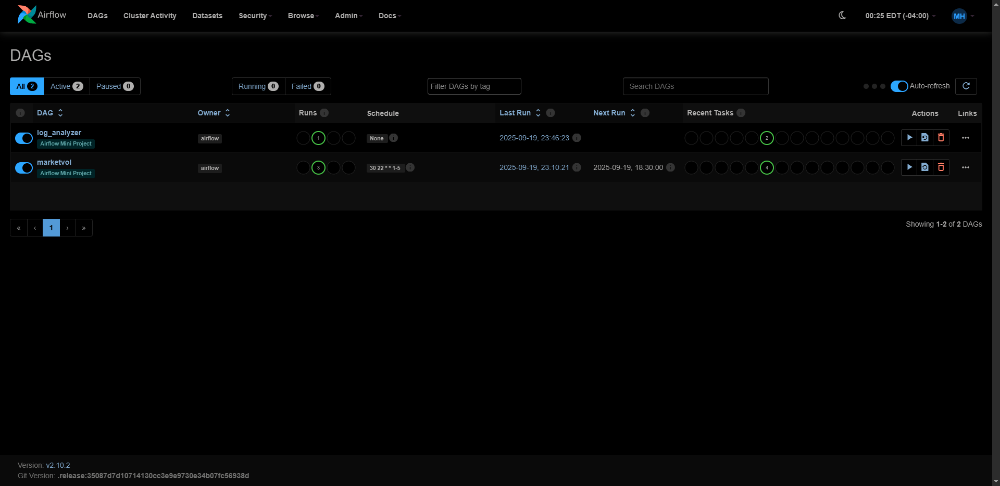

# Apache Airflow DAG Mini Project

## 📖 Abstract
This mini-project showcases orchestration and monitoring of a data pipeline using Apache Airflow. The pipeline fetches 1-minute intraday stock data for AAPL and TSLA via the Yahoo Finance API, scheduled to run at daily market close. The workflow DAG includes tasks for data extraction, CSV persistence, HDFS-style directory organization, and a final downstream query.
To enhance observability, a companion Python-based log analyzer parses Airflow scheduler logs. It uses `pathlib` and text processing to identify failures, warnings, and execution status across multiple DAG runs. The output includes aggregated error counts and detailed diagnostics to aid in root cause analysis.
The project reinforces key Airflow concepts such as DAG authoring, dependency management, Bash/Python operators, CeleryExecutor parallelism, and operational monitoring.
As part of the infrastructure, I authored `start-airflow.sh`, a WSL2-compatible Docker startup script that automates Airflow init, user creation, and service startup with race-condition safeguards and reset/debug modes.

## 🛠 Requirements
- Docker Engine v20+ and Docker Compose v2
- Ubuntu 22.04 LTS (tested) or compatible WSL2 environment
- docker-compose.yaml defining:
	- airflow-webserver (UI on http://localhost:8080)
	- airflow-scheduler
	- airflow-worker
	- postgres (metadata DB)
	- redis (Celery broker)
- Python dependencies (in requirements.txt):
	- yfinance
	- pandas
	- requests
	- apache-airflow-providers-postgres
	- apache-airflow-providers-redis
	- apache-airflow-providers-http
	- pytz

## 🧰 Setup
- Run bootstrap script:
	./start-airflow.sh --init    # Initializes Airflow metadata DB, creates user, starts services
	./start-airflow.sh --reset   # (Optional) Reset Airflow environment
	./start-airflow.sh --debug   # (Optional) Debug startup sequence

- If not using script, manual steps:
	- docker-compose build --no-cache
	- docker-compose run airflow-webserver airflow db init
	- Create Airflow user...
	- docker-compose up -d

- Access Airflow UI at http://localhost:8080
- Verify DAGs load from ./dags and logs from ./logs

## 📊 Dataset
- Yahoo Finance API data for AAPL and TSLA with 1-minute intervals.
Schema includes: date_time, open, high, low, close, adj_close, volume.

## ⏱️ Run Steps
- Start Docker services: docker-compose up -d
- Access the Airflow UI: http://localhost:8080
- Confirm DAG "marketvol" appears and is scheduled for weekdays at 6 PM
- Task breakdown:
	- t0: Initialize working directory (BashOperator)
	- t1, t2: Fetch AAPL and TSLA data (PythonOperator)
	- t3, t4: Move CSVs to target location (BashOperator)
	- t5: Execute custom query on combined data (PythonOperator)
- Monitor run via Airflow UI
- Run log_analyzer.py to extract error summaries and debug insights

## 📈 Outputs
- CSVs of intraday stock data for AAPL and TSLA
- Query results on combined dataset
- Airflow execution logs
- Log analyzer output: total error count and detailed error messages

## 📸 Evidence

  
Screenshot of Dockerized Airflow

  
Screenshot of Airflow UI

## 📎 Deliverables

- [`marketvol_dag.py`](./deliverables/marketvol_dag.py)

- [`log_analyzer_dag.py`](./deliverables/log_analyzer_dag.py)

- [`log_analyzer.py`](./deliverables/log_analyzer.py)

- [`marketvol_combined_log_2025-09-19_00-12-58.txt`](./deliverables/marketvol_combined_log_2025-09-19_00-12-58.txt)

- [`marketvol_combined_log_2025-09-20_03-10-16.txt`](./deliverables/marketvol_combined_log_2025-09-20_03-10-16.txt)

- [`report_download_aapl_2025-09-20_03-46-26.txt`](./deliverables/report_download_aapl_2025-09-20_03-46-26.txt)

- [`report_download_tsla_2025-09-20_03-46-29.txt`](./deliverables/report_download_tsla_2025-09-20_03-46-29.txt)

- [`start-airflow.sh`](./deliverables/start-airflow.sh)

- [`docker-compose.yaml`](./deliverables/docker-compose.yaml)

## 🛠️ Architecture
- Directed Acyclic Graph (DAG) with task parallelism
- CeleryExecutor for distributed task execution
- Python-based log analyzer integrated for observability
- Docker-based deployment using custom shell script

## 🔍 Monitoring
- Airflow UI for DAG run monitoring
- Python log analyzer for automated error detection and reporting

## ♻️ Cleanup
- Remove temp data directories under /tmp/data
- Optionally drop DAG definition from Airflow once complete

*Generated automatically via Python + Jinja2 + SQL Server table `tblMiniProjectProgress` on 09-20-2025 15:58:46*